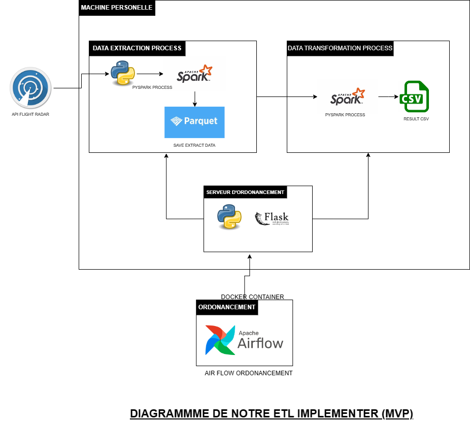
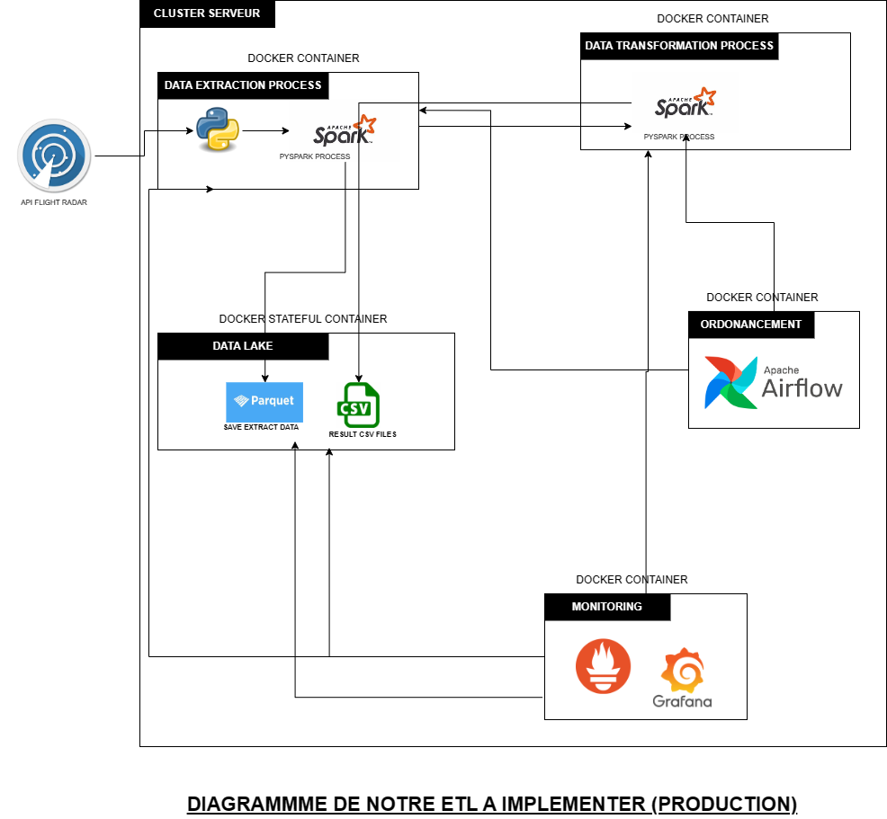

# FlightRadar24

# Sujet

Créer un pipeline ETL (Extract, Transform, Load) permettant de traiter les données de l'API [flightradar24](https://www.flightradar24.com/), qui répertorie l'ensemble des vols aériens, aéroports, compagnies aériennes mondiales.

> En python, cette librairie: https://github.com/JeanExtreme002/FlightRadarAPI facilite l'utilisation de l'API.

## Choix des technologies

# Diagram du mvp

# Diagram de l'architecture idéal de votre application industrialisée

# Skpark
* Spark permet via son api dataframe d'ecrire et de lire plusieurs formats de données ce qui facilite la mise en place de mécanisme stockage de données et la lecture de différentes sources de données
* Spark permet de distribuer les traitements sur plusieurs machine ce qui signifie qu'il nous permet de scaler facilement la capaciter de traitement pour gerer des volumes de plus en plus gros
* Spark traite ses données en memoire ce qui permet de rendre les jobs plus rapide
* l'api dataframe de spark est accessible depuis un ensemble de language (R, Python, Scala, Java) ce qui permet a beaucoup de developpeur de travailler avec cette api
* Spark peut ce connecter à beaucoup de source de données telle que HDFS pour le stockage de données
* Spark integre un grand nombre de libraire (Streming , Sql, GraphX) ce qui pourrait permettre de repondre à des besoins plus complexe de notre etl, telle q'un temps de traitement plus cours
* Spark a est opensource et a une tres grande communauté

# Airflow
* Orchestration : airflow permet de definir et orchestrer des flux de travail composés de différentes taches, et ceci dans un ordre specifique avec les posibilités d'avoir des dependances entre les taches
* Planification : airflow permet de planifier l'execution de notre flux de travail a une date données
* Monitoring  : airflow permet de  surveiller et gerer les pannes dans le flux de travail et de logger les messages d'erreurs
* Reprise apres pannes : airflow permet planifier la reprise d'une tache apres une panne ce qui permet de rendre le job plus resilient
* Opensource :  Aiflow est opensource
* Intégration avec d'autres outils : Prends en charges plusieurs operator comme des operateurs qui lance des spark, lance des scripts python, lance l'execution de ligne de commande

# Python
* Polyvalence : Python est polyvalent et populaire. Il est tres utilisé dans le domaine de la science des données, de l'apprentissage automatique, du développement web, de la mise en place d'ETL et peut facilement repondre à l'evolution des besoins de notre etl.
* Peut facilement s'integrer avec l'api de spark : Spark, propose une API Python appelée PySpark. Cette API permet aux développeurs d'écrire des scripts Spark en utilisant Python. les équipes qui préfèrent travailler avec Python peuvent bénéficier des capacités de traitement massivement parallèle de Spark sans avoir à apprendre un nouveau langage.
* Peut facilement s'integrer avec l'api de airflow : Les tâches dans Airflow peuvent être définies en utilisant du code Python, facilitant ainsi la création de flux de travail complexes et la gestion des dépendances. Python peut simplifier le développement et la maintenance des DAGs dans Airflow.
* Écosystème Python : Python dispose d'un vaste écosystème de bibliothèques et de modules qui peuvent être utilisés dans le cadre d'un projet ETL. Cela inclut des bibliothèques de manipulation de données, d'ecriture de données
* Facilité d'apprentissage : Python est connu pour sa simplicité et sa lisibilité, ce qui facilite l'apprentissage pour les nouveaux développeurs.
* Communauté : Python bénéficie d'une grande communauté active et dynamique

# flask (pour le mvp)
* flask permet de facilement creer des serveurs web ce qui nous permet dans ce contexte de facilement creer un serveur web avec lequelle airflow qui est dans docker va lancer des jobs sur notre machine
* l'ideal pour mettre notre application en production est de placer les scripts sur un serveur docker independant et de le connecter directeument à airflow

# Prometheus Graphana ( pas implementer)
* Surveillance des performances : Prometheus est un système de surveillance et d'alerte qui est conçu pour collecter des métriques temps réel sur les performances des applications. Il peut être configuré pour collecter des métriques provenant de divers services, y compris des applications Python, des clusters Spark, des tâches Airflow, etc. Ceci permet une surveillance approfondie des performances du système ETL.
* Collecte de métriques : Prometheus utilise un modèle de collecte de métriques par "pull". Cette approche est adaptée à un environnement ETL distribué où différentes parties du système peuvent être surveillées de manière centralisée.
* Intégration avec Docker : Prometheus peut être facilement intégré avec des conteneurs Docker. Il peut surveiller les métriques des conteneurs individuels ainsi que des applications s'exécutant dans ces conteneurs.
* Visualisation avec Grafana : Grafana est une plateforme de visualisation de données qui s'intègre bien avec Prometheus. Elle permet de créer des tableaux de bord personnalisés pour visualiser les métriques collectées. 

# Docker kubernetes ( pas implementer )

* Isolation des environnements : Docker permet d'encapsuler des applications et leurs dépendances dans des conteneurs légers. Cela assure une isolation des environnements, garantissant que chaque composant de l'ETL (Python, Spark, Airflow, etc.) fonctionne de manière cohérente, indépendante des variations de l'environnement sous-jacent.

* Portabilité : Les conteneurs Docker sont portables et peuvent être exécutés de manière cohérente sur différentes machines, environnements de développement et infrastructures cloud. Cela facilite le déploiement de l'ETL sur des environnements variés, que ce soit en local, sur des serveurs physiques, ou dans le cloud.

* Facilité de déploiement : Docker simplifie  le déploiement en encapsulant l'application et toutes ses dépendances dans un conteneur. Cela garantit une installation et une mise en service rapides

* Évolutivité avec Kubernetes : Kubernetes est un orchestrateur de conteneurs qui facilite la gestion, le déploiement et la mise à l'échelle des applications conteneurisées comme docker pour la montée en charge, la répartition des tâches et l'équilibrage de la charge.

* Gestion des ressources : Kubernetes permet de spécifier les ressources nécessaires à chaque conteneur, ce qui facilite la gestion des ressources dans un environnement ETL. Cela permet de garantir que les tâches Spark, les workflows Airflow et les autres composants ont les ressources nécessaires pour fonctionner efficacement.

* Auto-scalabilité : Kubernetes permet d'ajuster les ressources allouées aux conteneurs automatiquement en fonction de la charge de travail.

## Stockage des données

# ExtractionFiles

* ExtractionFiles contient l'ensemble des données issues de la phase d'xtraction des données de l'api, c'est données sont stocker au format parquet , format le plus facile pour la lecture et l'ecriture des données

* Nommenclature du stockage des données horodatées:
Ex: `Airport\rawzone\tech_year=2024\tech_month=January-2024\tech_day=26-January-2024\airport-(26-January-2024,18)\airport1706290217.885872.parquet`

la nomencalture est horodatée et permettant aux data analyst de retrouver les valeurs recherchées pour un couple `(Date, Heure)` donné

* les differentes données écrites:

* * Acflight : va stocker les données pertinentes sur l'ensemble des vols actifs
* * Airlines : va stocker les données pertinentes sur les compagnies aériennes
* * Airport : va stocker les données pertinentes sur les compagnies aéroports
* * Flctry  : va stocker les données pertinentes sur les vols par pays
* * Flight : va stocker les données pertinentes sur tous les vols
* * Zctinent : va stocker les données pertinentes sur les continents et leurs coordonnées
* * Znctry : va stocker les données pertinentes sur les pays et leurs coordonées et leurs continents
* * Zncty : va stocker les données pertinentes sur les villes et leurs coordonées et leurs pays
* * Znctyn : va stocker les données pertinentes sur les pays et leurs coordonées et leurs continents en mixant les composants

# ResultFiles

* ResultFiles contient l'ensemble des données issues de la phase de netoyage et de transformation des données de l'api, c'est données sont stocker au format csv , format le plus facile pour permettre à des data analyst de facilement manipuler les resultats de calculs sparks

* Nommenclature du stockage des données :
Ex: `Resultatquestion1\rawzone\tech_year=2024\tech_month=January-2024\tech_day=28-January-2024\ResultatQuestion1-(28-January-2024,23)\ResultatQuestion11706481280.133746.csv`
la nomencalture est horodatée et permettant aux data analyst de retrouver les valeurs recherchées pour un couple `(Date, Heure)` donné

* les differentes données écrites:
* * Resultatquestion1 : va stocker la compagnie avec le + de vols en cours
* * Resultatquestion2 : va stocker pour chaque continent, la compagnie avec le + de vols régionaux actifs (continent d'origine == continent de destination)
* * Resultatquestion3 : va stocker Le vol en cours avec le trajet le plus long
* * Resultatquestion4 : va stocker pour chaque continent, la longueur de vol moyenne
* * Resultatquestion5 : va stocker l'entreprise constructeur d'avions avec le plus de vols actifs
* * Resultatquestion6 : va stocker pour chaque pays de compagnie aérienne, le top 3 des modèles d'avion en usage
* * Resultatquestion7 : va stocker l'aéroport a la plus grande différence entre le nombre de vol sortant et le nombre de vols entrants

## Tutoriel d'installation

# Spark installation sur windows
* Installer java
* Rajouter le java path aux variables d'environnement
* telecharger [spark 3.0.0 et hadoop2.7](https://spark.apache.org/downloads.html)
* Rajouter le hadoop path aux variable d'environement
* Rajouter [winsutils](https://github.com/cdarlint/winutils) au dossier bin dans le hadoop path 

# python installation
* installation de python : 
* * telecharger la version de [python 3.8.10](https://www.python.org/downloads/release/python-3810/)
* * installer python et ajouter le dossier aux variables d'environnements

* installer le module pour un environnement virtuelle :
pip install virtualenv

* creer l' environnement virtuelle :
virtualenv flight-air1

* demarrer l'environnement virtuell
.\flight-air1\Scripts\activate

* installation des dependenses :
pip install -r requirements.txt

* demarrer le serveur flask
python server-flask-lauch-extraction_transformation-script.py

# tester le script d'extraction de données
python flight-extraction-script.py

# tester le script de transformation des données
python flight-transformation-script.py

# visualiser les resultats a l'aide de csv ou jupiter
* Lancer jupyter
* * lancer la commande jupyter notebook
* * ouvrir le notebook Resultats.ipynb

# installer docker et airflow
se deplacer airflow-pyspark-docker
installer docker compose

docker build -f Dockerfile.airflow . -t airflow-spark:latest
set AIRFLOW_UID=50000
docker-compose -f docker-compose.airflow.yaml up airflow-init
docker-compose -f docker-compose.airflow.yaml up

# lancer le job d'ordonnancement

ce job est fault tolerent
sexecute toute les dux hore

## Industrialisation

Ce kata est orienté **industrialisation**. Le pipeline ETL doit être pensé comme un job se faisant éxécuter à échéance régulière (ex: toutes les 2 heures).

> **Pour le rendu, Poussez sur une nouvelle branche git, ouvrez une merge request vers Main, et notifiez votre interlocuteur par message que le kata est fini.

* Votre pipeline `DOIT` inclure une phase de [data cleaning](https://fr.wikipedia.org/wiki/Nettoyage_de_donn%C3%A9es)

